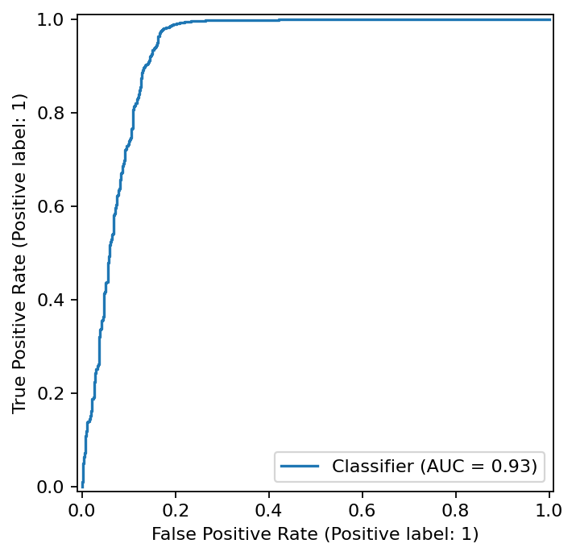
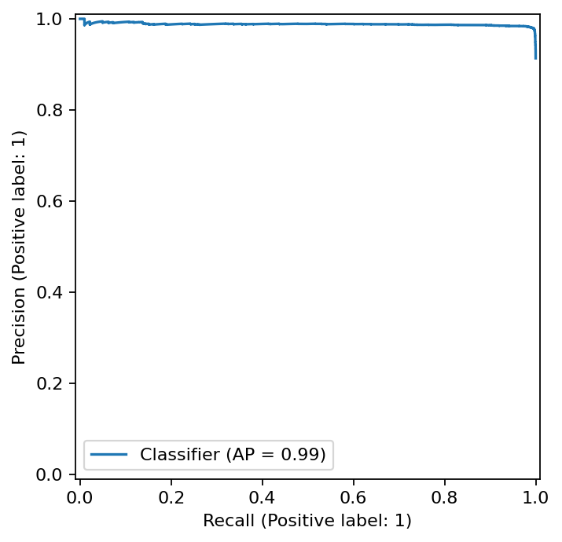
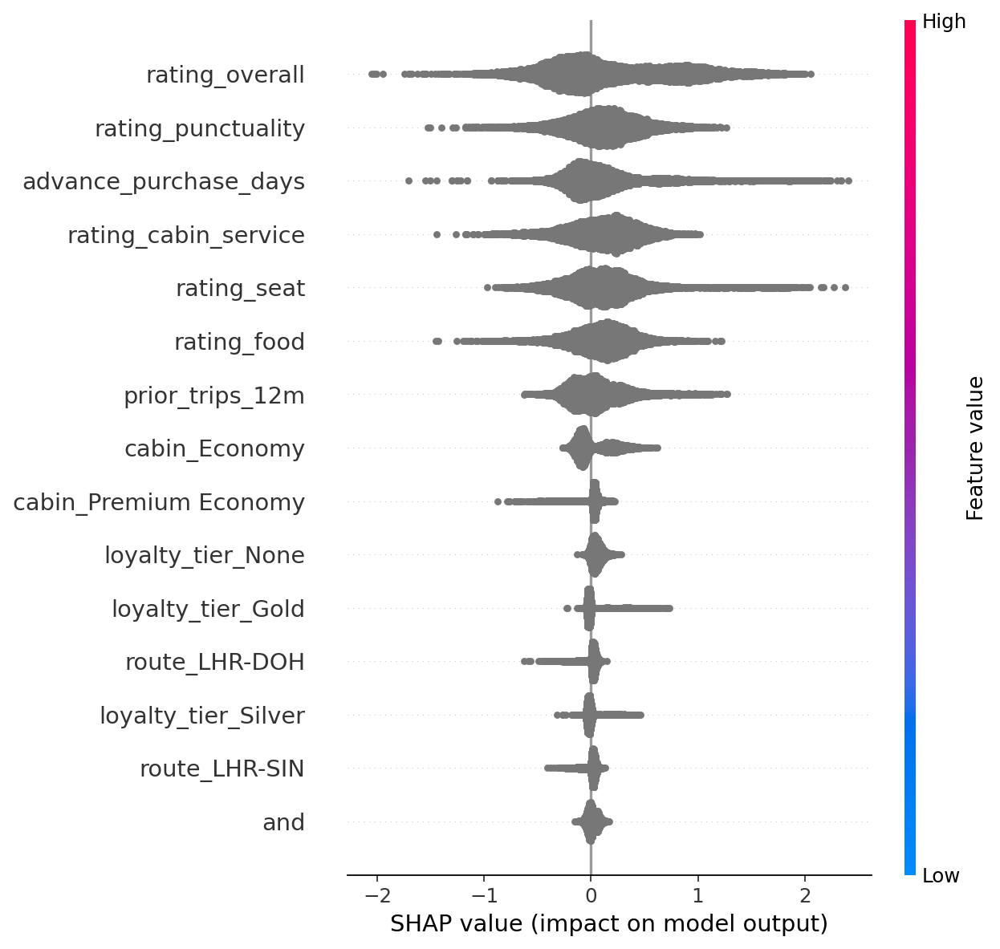

# British Airways — Customer Review Insights & Buying Behavior Modeling


Analyze **British Airways customer reviews** (synthetic/public) to:
- Extract insights from reviews  
- Build a predictive model for buying behavior  
- Run business simulations to estimate impact on conversion and satisfaction  
- Explore results in an interactive dashboard  

> ⚠️ This is a **learning project using synthetic/public data**. It is **not affiliated with British Airways**.

---

## 🚀 Quickstart

```bash
# 1. Create virtual environment
python -m venv .venv && source .venv/bin/activate   # Windows: .venv\Scripts\activate

# 2. Install dependencies
pip install -r requirements.txt

# 3. Train model
python -m src.train_model

# 4. Run simulations
python -m src.simulate

# 5. Evaluate (curves + SHAP plots)
python -m src.evaluate

Artifacts will be saved in:
- `models/artifacts/` → trained model  
- `models/reports/` → metrics, simulation results, and plots  

---

## 📊 Results Snapshot

### Model Performance
- Metrics (AUC, PR-AUC): `models/reports/metrics.txt`  
- ROC & PR curves:  
    
    

### Scenario Simulations
| Scenario           | Baseline | Scenario P | Avg Lift |
|--------------------|----------|------------|----------|
| Seat comfort +0.5  | 0.921    | 0.928      | +0.007   |
| On-time +10pp      | 0.921    | 0.936      | +0.015   |
| Lounge voucher     | 0.921    | 0.921      | +0.000   |

### Drivers of Buying Behavior
Feature importances from SHAP:  


---

## 🖥 Interactive Dashboard

Run locally with Streamlit:

```bash
streamlit run app.py
Then open http://localhost:8501 in your browser.

Dashboard preview:


🔄 CI/CD
This repo includes a GitHub Actions CI pipeline (.github/workflows/ci.yml) which:

Installs dependencies

Trains the model

Runs simulations

Evaluates (ROC, PR, SHAP)

Executes unit tests

Ensures reproducibility and code quality ✅ on every push.

📜 License
MIT License — free to use, modify, and share.

